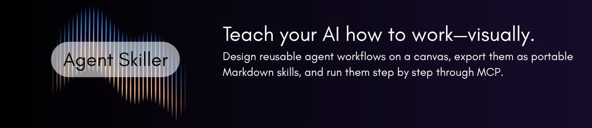
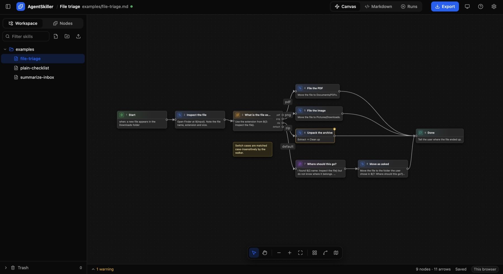

<div align="center">
  
</div>

<br/>

<h1 align="center"><code>agent-skiller</code></h1>

---

<div align="center">


<a href="https://agent-skiller.vercel.app"></a>


</div>

<p align="center">
  <code>agent-skiller</code> คือเครื่องมือโอเพนซอร์สที่ช่วยให้คุณวาดขั้นตอนการทำงาน แล้วเปลี่ยนเป็นสกิลที่ AI Agent ทำตามได้ทีละขั้น
</p>

<p align="center">
  <a href="https://agent-skiller.vercel.app">ลองใช้ออนไลน์</a> · <a href="#วิธีรัน">วิธีรัน</a> · <a href="#รูปแบบไฟล์">รูปแบบไฟล์</a> · <a href="#เชื่อมต่อกับ-ai-agent">เชื่อมต่อกับ AI Agent</a>
</p>

<p align="center">
  <a href="README.md">English</a> · <a href="README.zh-CN.md">中文</a> · <strong>ไทย</strong>
</p>

<br/>



วางขั้นตอน ทางเลือก และลูปลงบนแคนวาส แล้วส่งออกเป็นไฟล์ Markdown ไฟล์เดียวที่เปิดอ่านหรือแก้เองได้ง่าย
จากนั้น AI Agent ก็หยิบสกิลไปใช้ผ่าน MCP และทำตามทีละขั้นได้เลย โดยไม่ต้องคิดแผนทั้งหมดขึ้นมาใหม่ทุกครั้ง
ถ้าใช้เวอร์ชันออนไลน์ สกิลจะเก็บอยู่ในเบราว์เซอร์ของคุณเท่านั้น ไม่มีการอัปโหลดขึ้นเซิร์ฟเวอร์

## ทำไม AgentSkiller ถึงต่าง

เครื่องมือสร้างสกิลแบบเห็นภาพส่วนใหญ่มักจบที่การสร้างเอกสาร แต่ AgentSkiller ทำให้แผนภาพเป็นสิ่งที่ AI Agent
*ลงมือทำตามได้จริง* ไม่ใช่แค่เปิดอ่าน:

- **มีทางเลือกและลูปที่ทำงานได้จริง** `If`, `Switch` และ `Loop` เป็นส่วนหนึ่งของแผนภาพอย่างชัดเจน
  ลูกศรแต่ละเส้นมีชื่อและระบบจะตรวจความถูกต้องก่อนส่งออก AI Agent จึงไม่ต้องเดาความหมายจากข้อความยาว ๆ เอง
- **ส่งให้ AI ทำทีละขั้นผ่าน MCP** AI Agent เริ่มด้วย `start_run` แล้วเรียก `next_step` เพื่อรับขั้นถัดไป
  แต่ละครั้งจะเห็นเฉพาะสิ่งที่ต้องทำตอนนั้น พร้อมค่าที่อ้างอิงไว้แล้ว ตัวไฟล์จะเป็นคนเก็บแผนทั้งหมดไว้
  AI จึงไม่ต้องจำทุกอย่างไว้ในบทสนทนา
- **ย้อนดูการทำงานได้ทุกครั้ง** ระบบเก็บไว้ว่าไปถึงขั้นไหน เลือกเส้นทางใด และได้ผลลัพธ์อะไรกลับมา
  คุณยังลองเดินตามสกิลเองในแท็บ Runs ได้ เหมือนกับที่ AI Agent ทำ
- **รันโค้ดในแซนด์บ็อกซ์** โหนด `Code` รัน Python หรือ JavaScript ในโปรเซสแยก
  พร้อมจำกัดเวลาและหน่วยความจำ ก่อนส่งผลลัพธ์ให้ขั้นถัดไป
- **เปิดแก้ Markdown เองได้อย่างสบายใจ** เมื่อนำไฟล์เข้าแล้วบันทึกออกมาอีกครั้ง เนื้อหาจะยังเหมือนเดิมทุกไบต์
  (`serialize(parse(file))`) แม้แต่บรรทัดที่ระบบไม่รู้จักก็ยังถูกเก็บไว้ ส่วนการอ้างอิงอย่าง `${2: Open inbox}`
  จะอัปเดตชื่อให้ใหม่ทุกครั้งที่บันทึก คุณจึงเปลี่ยนชื่อขั้นตอนได้โดยลิงก์ไม่พัง และข้อมูลส่วนหัวก็ใช้ร่วมกับ `SKILL.md` ได้
- **ให้ AI ช่วยร่างจากคำอธิบายได้** คลิกขวาบนแคนวาส อธิบายงานที่ต้องการ และแนบภาพหน้าจอของปุ่มที่ต้องกดได้
  ระบบจะส่งรายละเอียดของโหนดให้โมเดลโดยตรง ตรวจคำตอบด้วยตัวแยกวิเคราะห์ตัวเดียวกับที่ใช้เปิดไฟล์
  และให้คุณดูก่อนเสมอว่าจะนำอะไรลงแคนวาส
- **ใช้ได้ทั้งบนเว็บและเซิร์ฟเวอร์ในเครื่อง** บิลด์เดียวกันเปิดเป็นหน้าเว็บสแตติกได้ โดยเก็บสกิลไว้ในเบราว์เซอร์
  (หรือเลือกเก็บในโฟลเดอร์บนเครื่องเมื่อใช้ Chrome และ Edge) ถ้าต้องการแซนด์บ็อกซ์และ MCP ก็ต่อกับเซิร์ฟเวอร์ในเครื่องได้

## วิธีรัน

**ใช้ผ่านเบราว์เซอร์** เปิดเว็บไซต์ออนไลน์ได้ทันที หรือจะนำ `web/dist` ไปโฮสต์เองก็ได้:

```bash
npm install && npm run build:static
```

**ใช้พร้อมเซิร์ฟเวอร์ในเครื่อง** เมื่อต้องการรันโค้ดหรือเชื่อมต่อกับ AI Agent:

```bash
./run.sh            # เปิด API ที่พอร์ต 4280 และหน้าเว็บพร้อม hot reload ที่พอร์ต 5273
./run.sh mcp        # แสดงวิธีเชื่อมต่อ MCP client
```

ต้องมี Node 22+ และ Python 3

## รูปแบบไฟล์

```markdown
---
name: summarize-inbox
description: Read unread mail and report a five-line summary.
format: agent-skiller/1
---

# Summarize inbox

## 1. Start
- when: summarize my inbox
- next: 2

## 2. Do: Open inbox
Open the Mail app and select the Inbox folder.
- next: 3

## 3. If: Any unread messages?
Look at the message list from ${2: Open inbox}.
- yes: 4
- no: 5

## 4. Loop: For each unread message in ${2: Open inbox}
Open it. Note the sender, subject and the first two sentences.
- next: 6

## 5. End: Nothing new
Tell the user there are no unread messages.

## 6. End: Report
Tell the user, in at most five lines, what is new.
```

ในไฟล์นี้ หัวข้อ `##` แต่ละอันคือหนึ่งขั้น `- next: 3` คือลูกศรที่ชี้ไปยังขั้นถัดไป และข้อความที่เหลือคือคำสั่ง
มีขั้นให้เลือก 16 แบบ แบ่งเป็น 5 กลุ่ม: Flow (Start, End, Error), Steps (Do, Ask, Confirm, Text),
Logic (If, Switch, Loop), Tools (Command, Code, Web, File, Request) และ Reuse (Skill) พร้อมโน้ตแปะ 8 สี

โหนด Command และ Code จะทำงานบนเครื่องที่ AI Agent ควบคุมอยู่ โดย AgentSkiller ไม่ได้ตรวจหรือจำกัดว่าคำสั่งนั้นทำอะไร
ถ้ามีขั้นตอนไหนที่อาจลบหรือทำให้ข้อมูลเสียหาย ควรวาง Confirm ไว้ก่อนเสมอ ส่วนโฟลเดอร์ `examples/`
มีตัวอย่างสกิลแบบครบ ๆ ให้ดู และไฟล์เหล่านี้ยังใช้ทดสอบตัวแยกวิเคราะห์ด้วย

## เชื่อมต่อกับ AI Agent

ใช้ MCP client ตัวไหนก็ได้ ถ้าเซิร์ฟเวอร์กำลังทำงานอยู่ ให้เชื่อมต่อผ่าน HTTP แบบนี้:

```json
{ "mcpServers": { "agent-skiller": { "url": "http://127.0.0.1:4280/mcp" } } }
```

หรือเชื่อมต่อผ่าน stdio ได้โดยไม่ต้องเปิดเซิร์ฟเวอร์:

```json
{ "mcpServers": { "agent-skiller": { "command": "node", "args": ["server/dist/mcp-stdio.js"] } } }
```

เครื่องมือ: `list_skills`, `get_skill`, `skill_format`, `validate_skill`, `save_skill`,
`start_run`, `next_step`, `get_run`, `run_code`

## โครงสร้างโปรเจกต์

```
packages/core   โมเดล, ตัวแยกวิเคราะห์และตัวเขียน Markdown, การตรวจสอบ, ตัวเดินรัน, AI client, CLI
server          Fastify API, MCP (HTTP และ stdio), แซนด์บ็อกซ์
web             ตัวแก้ไข React Flow พร้อมที่เก็บข้อมูลแบบเบราว์เซอร์ โฟลเดอร์ และเซิร์ฟเวอร์
examples/       สกิลตัวอย่าง และชุดทดสอบของตัวแยกวิเคราะห์
```

```bash
npm test          # core, server, web
npm run build
```

Apache-2.0
